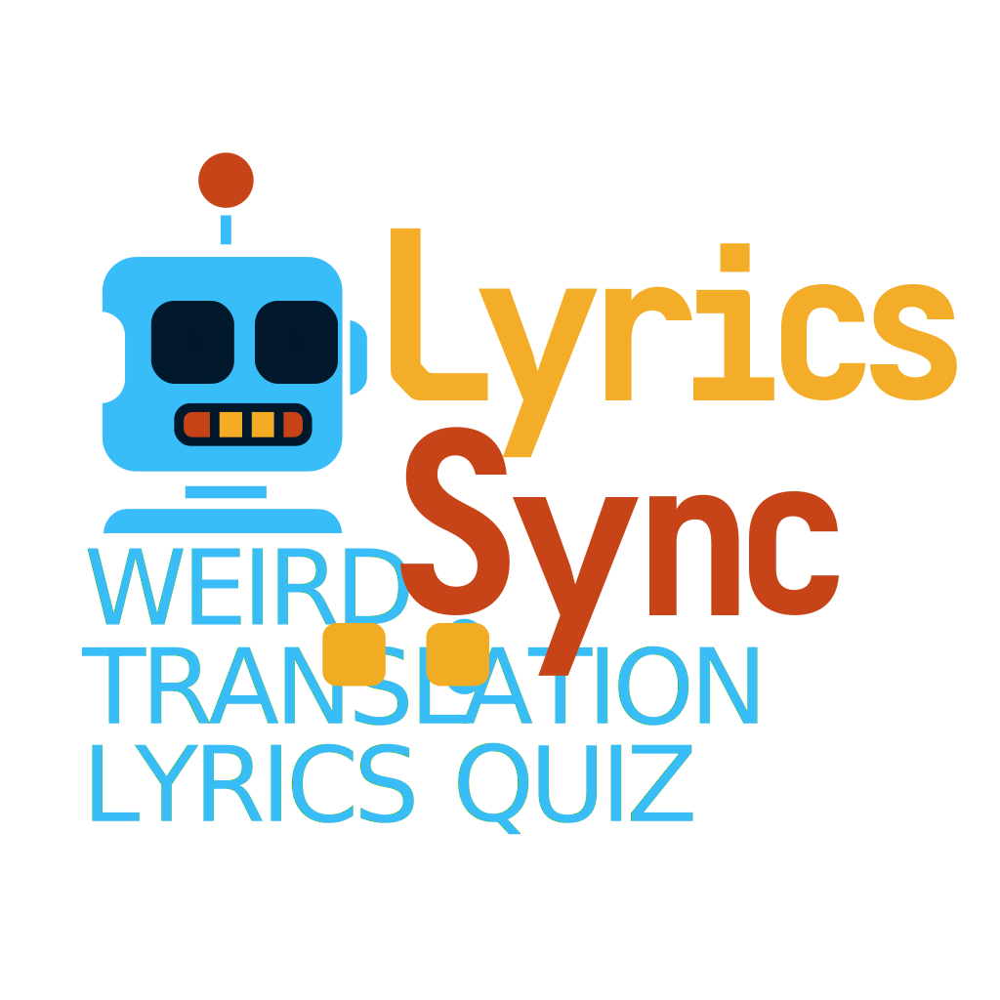
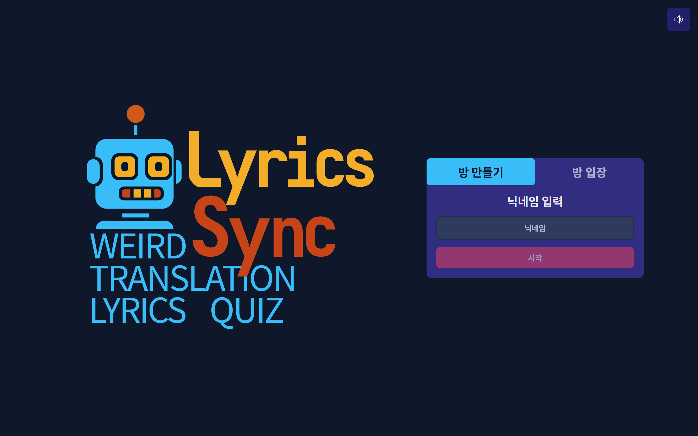
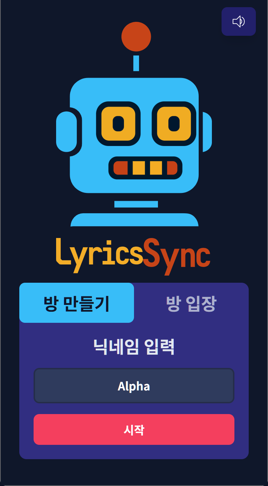
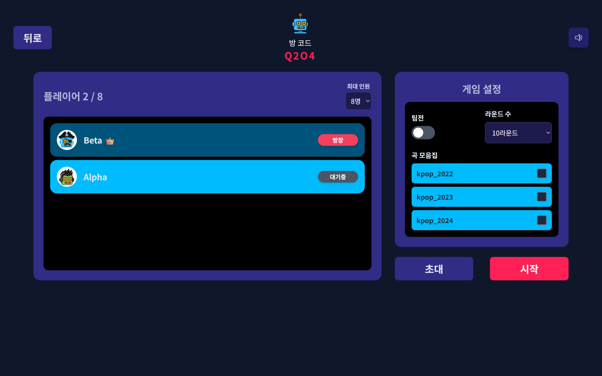
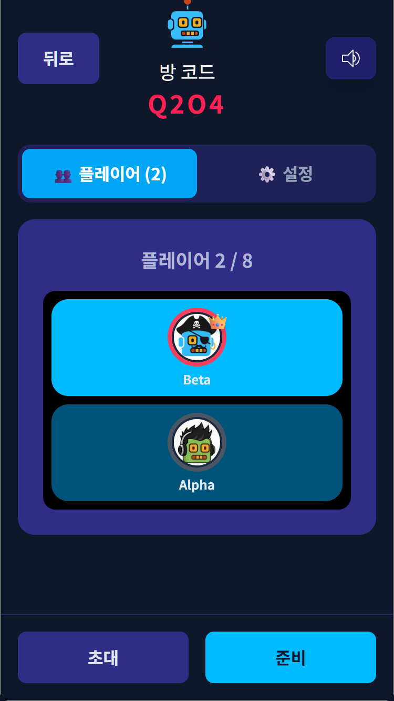
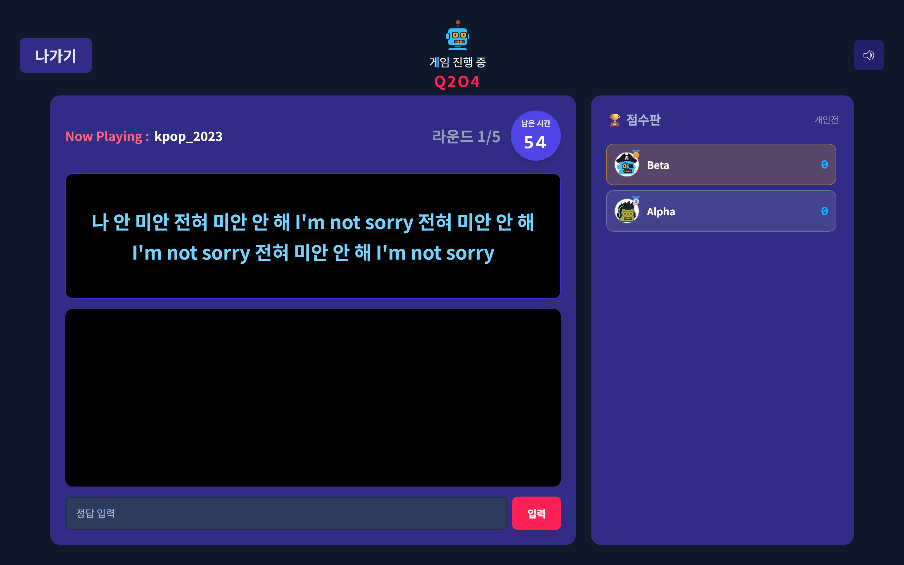
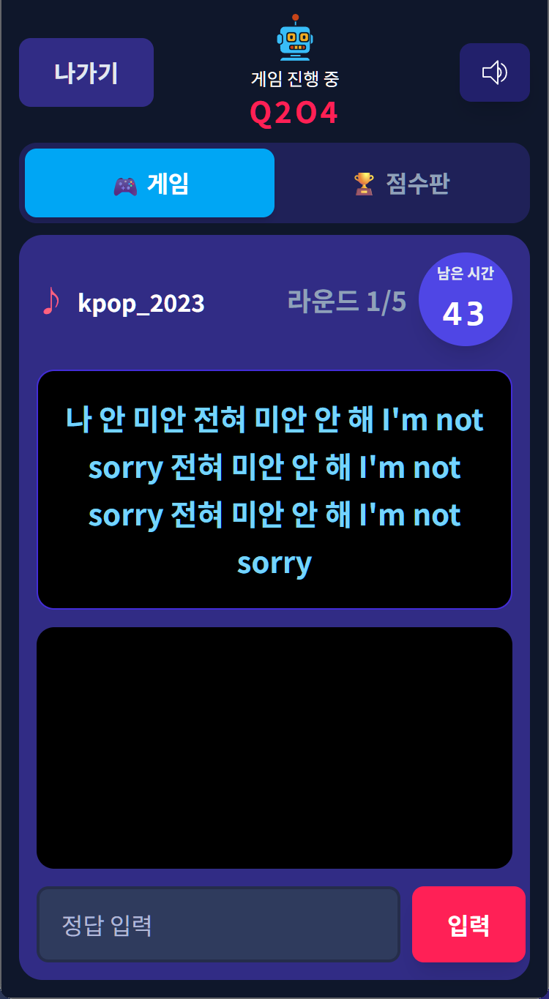
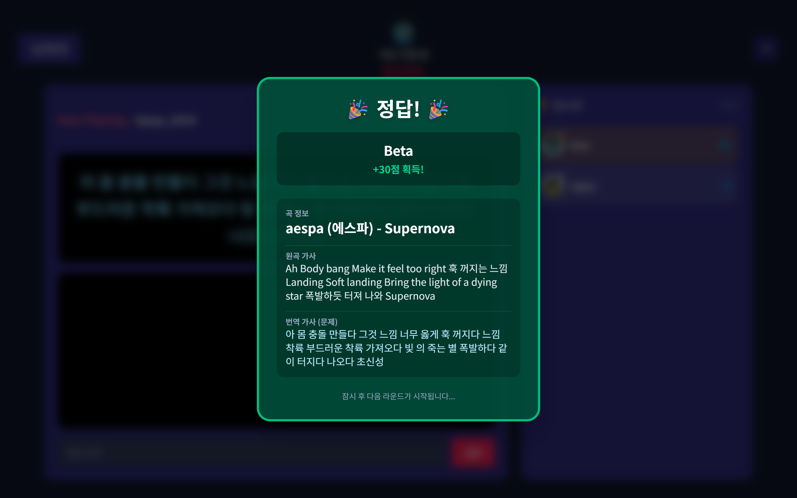
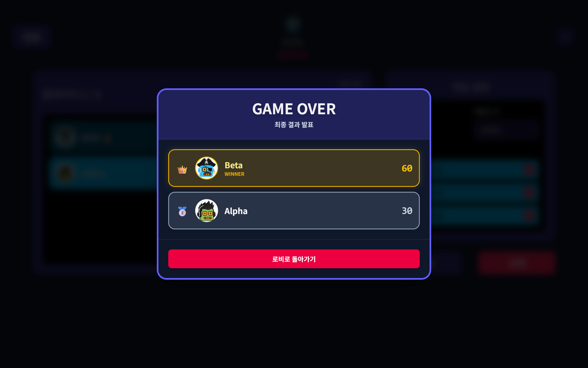
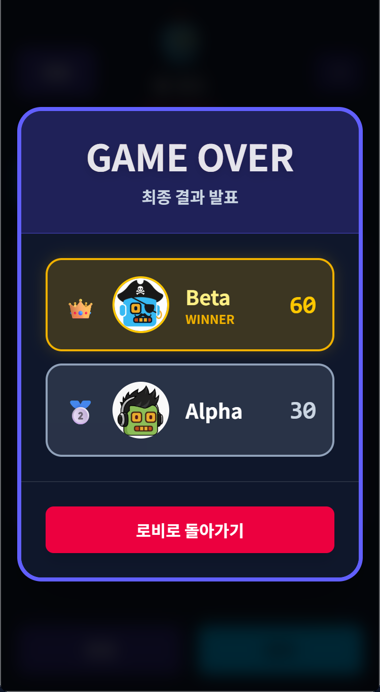

<div align="center">
  
</div>

<h3 align="center">
  <a href="https://lyrics-sync-client.vercel.app/">
    🚀 <strong>게임 플레이하러 가기</strong>
  </a>
</h3>

<p align="center">
  <strong>AI가 번역한 엉뚱한 가사를 보고 원곡을 맞히는 실시간 멀티플레이 퀴즈 게임</strong><br/>
  친구들과 링크 하나로 간편하게 즐기는 웹 기반 파티 게임입니다.
</p>

<div align="center">
  <a href="./PRD/prd.pdf">📄 프로젝트 기획서 (PRD)</a> | 
  <a href="./PRD/onepager.pdf">📑 원페이저 (One-Pager)</a>
</div>

---

## 📸 게임 스크린샷 (Screenshots)

<table>
  <thead>
    <tr>
      <th width="15%" align="center">화면 (Screen)</th>
      <th width="55%" align="center">Desktop</th>
      <th width="30%" align="center">Mobile</th>
    </tr>
  </thead>
  <tbody>
    <tr>
      <td align="center"><b>메인 화면</b></td>
      <td align="center"></td>
      <td align="center"></td>
    </tr>
    <tr>
      <td align="center"><b>로비 화면</b></td>
      <td align="center"></td>
      <td align="center"></td>
    </tr>
    <tr>
      <td align="center"><b>게임 화면</b></td>
      <td align="center"></td>
      <td align="center"></td>
    </tr>
    <tr>
      <td align="center"><b>정답 화면</b></td>
      <td align="center"></td>
      <td align="center"></td>
    </tr>
    <tr>
      <td align="center"><b>순위 화면</b></td>
      <td align="center"></td>
      <td align="center"></td>
    </tr>
  </tbody>
</table>

> *데스크톱 및 모바일 환경을 모두 지원하는 반응형 디자인(Responsive Design)이 적용되었습니다.*

---

## 🌎 프로젝트 구조 (Monorepo)

이 레포지토리는 3개의 개별 프로젝트로 구성된 모노레포입니다.

1.  **`lyrics-sync-client/`**: 유저들이 게임을 플레이하는 **React 클라이언트**
2.  **`lyrics-sync-server/`**: 게임 로직, DB, API를 담당하는 **Node.js 통합 서버**
3.  **`lyrics-sync-admin-client/`**: 퀴즈 데이터와 요청을 관리하는 **관리자 대시보드**

---

## ✨ 주요 기능 (Key Features)

### 🎵 게임 클라이언트 (`lyrics-sync-client`)

* **실시간 멀티플레이:** `Socket.IO`를 이용해 지연 없는 퀴즈 진행 및 채팅을 지원합니다.
* **접근성:** 별도의 설치나 회원가입 없이 **URL 링크 공유**만으로 즉시 방에 입장할 수 있습니다.
* **게임 모드:**
    * **개인전:** 개인별 점수 경쟁 및 순위 산정.
    * **팀전 (A/B팀):** 팀원 점수 합산 경쟁 모드 지원.
* **AI 퀴즈 콘텐츠:** Google Gemini Pro가 생성한 '번역기투'의 엉뚱한 가사 퀴즈 제공.
* **인게임 시스템:**
    * **동적 점수:** 30초(30점) → 45초(20점/초성힌트) → 60초(10점/가수힌트) 단계별 차등 점수 지급.
    * **자동완성:** DB에 등록된 노래 제목 자동완성으로 입력 편의성 제공.
    * **아바타:** 15종의 로봇 아바타 랜덤 배정.
    * **사운드 & 모션:** `Framer Motion` 애니메이션과 상황별 효과음(정답, 오답, 타이머 등) 적용.

### 🛠️ 관리자 대시보드 (`lyrics-sync-admin-client`)

* **Google OAuth 인증:** 보안을 위해 구글 로그인을 사용합니다.
* **RBAC (역할 기반 접근 제어):**
    * **Admin (관리자):** 노래 추가/수정/삭제 즉시 반영, 유저 요청 승인/거절 권한.
    * **Viewer (일반 유저):** 데이터 조회 가능, 수정/삭제는 '요청(Request)'만 가능.
* **요청 승인 시스템:** 일반 유저가 보낸 변경 요청을 관리자가 검토 후 DB에 반영하는 워크플로우.
* **AI 도구:** 가사 원본을 입력하면 Gemini가 즉시 퀴즈용 번역 가사를 생성해주는 도구 내장.

### ⚙️ 통합 서버 (`lyrics-sync-server`)

* **MVCS 아키텍처:** 유지보수를 위해 `Model`, `View(JSON)`, `Controller`, `Service` 계층으로 코드 분리.
* **Socket.IO 로직:** 방 생성, 유저 입장/퇴장, 게임 루프, 타이머 동기화 등 핵심 로직 처리.
* **REST API:** 관리자 페이지 및 게임 초기 데이터(곡 모음집 등) 제공.
* **MongoDB (Mongoose):**
    * `Song`: 노래 데이터 (한 곡이 여러 모음집에 속하는 배열 구조).
    * `User`: 관리자 정보 및 권한 관리.
    * `EditRequest`: 수정 요청 대기열 관리.
* **자동 배포 (CI/CD):** GitHub Webhook을 통해 `main` 브랜치 푸시 시 서버 자동 업데이트 및 재시작.

---

## 💾 데이터베이스 스키마 (MongoDB)

MongoDB(Mongoose)를 사용하여 다음과 같은 데이터 모델을 관리합니다.

### 1. Song (노래 데이터)
실제 게임에서 출제되는 퀴즈 데이터입니다.
| Field | Type | Description |
| :--- | :--- | :--- |
| `title` | String | 노래 제목 (정답) |
| `artist` | String | 가수 이름 (힌트 제공용) |
| `original_lyrics` | String | 원본 가사 |
| `translated_lyrics` | String | Gemini가 생성한 엉뚱한 번역 가사 (퀴즈 문제) |
| `hint` | String | 초성 힌트 |
| `collectionNames` | [String] | 노래가 속한 모음집 태그 배열 (예: `["kpop-2023", "ballad"]`) |

### 2. User (관리자 유저)
관리자 페이지 접속 유저 및 권한 정보입니다.
| Field | Type | Description |
| :--- | :--- | :--- |
| `email` | String | 구글 이메일 (고유값) |
| `name` | String | 유저 이름 |
| `role` | String | 권한 등급 (`'admin'` 또는 `'viewer'`) |
| `createdAt` | Date | 가입일 |

### 3. EditRequest (수정 요청)
일반 유저(Viewer)가 보낸 변경 요청 대기열입니다.
| Field | Type | Description |
| :--- | :--- | :--- |
| `requesterEmail` | String | 요청자 이메일 |
| `requestType` | String | 요청 종류 (`'create'`, `'update'`, `'delete'`) |
| `targetSongId` | ObjectId | 수정/삭제 대상 노래 ID (Optional) |
| `data` | Object | 변경하려는 노래 데이터 (JSON) |
| `status` | String | 처리 상태 (`'pending'`, `'approved'`, `'rejected'`) |

---

## 📡 API & Socket Events

### 1. REST API Endpoints
서버는 Express.js를 통해 다음 API를 제공합니다.

#### Public API
* **`GET /api/public/collections`**: DB에 존재하는 모든 곡 모음집(태그) 목록을 반환합니다. (게임 로비 설정용)

#### Admin API (Google Login & JWT 인증 필요)
* **`POST /api/admin/google-login`**: 구글 인증 토큰을 검증하고 서버 전용 JWT를 발급합니다.
* **`GET /api/admin/songs`**: 전체 노래 목록을 조회합니다.
* **`POST /api/admin/generate-translation`**: Gemini AI를 호출하여 가사를 번역합니다.
* **`POST /api/admin/request`**: (Viewer용) 노래 추가/수정/삭제 요청을 제출합니다.
* **`GET /api/admin/requests`** (Admin Only): 대기 중인 수정 요청 목록을 조회합니다.
* **`POST /api/admin/requests/:id/approve`** (Admin Only): 요청을 승인하고 실제 DB(`Song`)에 반영합니다.
* **`POST /api/admin/requests/:id/reject`** (Admin Only): 요청을 거절합니다.
* **`POST/PUT/DELETE /api/admin/songs`** (Admin Only): 노래 데이터를 직접 조작합니다.

### 2. Socket.IO Events
실시간 게임 진행을 위한 웹소켓 이벤트 구조입니다.

| Direction | Event Name | Description |
| :--- | :--- | :--- |
| **Client → Server** | `createRoom` | 방장이 새로운 방을 생성합니다. |
| | `joinRoom` | 플레이어가 방 코드를 입력하여 입장합니다. |
| | `updateSettings` | 방장이 게임 설정(라운드, 모음집 등)을 변경합니다. |
| | `playerReady` | 플레이어가 준비 상태를 토글합니다. |
| | `startGame` | 방장이 게임을 시작합니다. |
| | `submitAnswer` | 플레이어가 정답을 제출합니다. |
| **Server → Client** | `updateLobby` | 대기실 상태(참가자, 설정)가 변경될 때 브로드캐스트합니다. |
| | `newQuiz` | 새 라운드 문제(가사)와 타이머 정보를 전송합니다. |
| | `showHint` | 특정 시간 경과 시 힌트(초성/가수)를 전송합니다. |
| | `correctAnswer` | 정답자가 발생했을 때 알림 및 점수를 갱신합니다. |
| | `gameOver` | 게임 종료 시 최종 결과를 전송합니다. |

---

## 🛠️ 기술 스택 (Tech Stack)

| 구분 | 기술 | 설명 |
| :--- | :--- | :--- |
| **Frontend** | **React, Vite** | 빠른 빌드 및 모던 UI 개발 |
| | **Tailwind CSS** | 유틸리티 퍼스트 CSS 프레임워크 |
| | **Framer Motion** | 부드러운 UI 애니메이션 구현 |
| | **Axios** | REST API 비동기 통신 |
| | **Socket.IO Client** | 실시간 웹소켓 통신 |
| **Backend** | **Node.js, Express** | 서버 런타임 및 API 프레임워크 |
| | **Socket.IO** | 실시간 양방향 통신 |
| | **MongoDB, Mongoose** | NoSQL 데이터베이스 및 ODM |
| | **Google Gemini API** | AI 번역 가사 생성 |
| | **Google Auth Library** | OAuth 2.0 인증 및 JWT 발급 |
| **DevOps** | **Vercel** | 클라이언트(Game, Admin) 배포 |
| | **MS Azure (VM)** | 서버 배포 (PM2, Nginx, Docker) |
| | **GitHub Actions** | CI/CD 자동화 (Webhook 활용) |

---

## 🛠️ 기술 스택 (Tech Stack)

| 구분 | 기술 | 설명 |
| :--- | :--- | :--- |
| **Frontend** | **React, Vite** | 빠른 빌드 및 모던 UI 개발 |
| | **Tailwind CSS** | 유틸리티 퍼스트 CSS 프레임워크 |
| | **Framer Motion** | 부드러운 UI 애니메이션 구현 |
| | **Axios** | REST API 비동기 통신 |
| | **Socket.IO Client** | 실시간 웹소켓 통신 |
| **Backend** | **Node.js, Express** | 서버 런타임 및 API 프레임워크 |
| | **Socket.IO** | 실시간 양방향 통신 |
| | **MongoDB, Mongoose** | NoSQL 데이터베이스 및 ODM |
| | **Google Gemini API** | AI 번역 가사 생성 |
| | **Google Auth Library** | OAuth 2.0 인증 및 JWT 발급 |
| **DevOps** | **Vercel** | 클라이언트(Game, Admin) 배포 |
| | **MS Azure (VM)** | 서버 배포 (PM2, Nginx) |
| | **GitHub Actions** | CI/CD 자동화 (Webhook 활용) |

---

## 🚀 설치 및 실행 가이드 (Local)

이 프로젝트는 3개의 터미널에서 각각 실행해야 합니다.

### 1. 환경 변수 설정 (.env)

각 폴더(`server`, `client`, `admin`) 루트에 `.env` 파일을 생성하고 필요한 키를 입력하세요.
* **Server:** `MONGO_URI`, `GEMINI_API_KEY`, `GOOGLE_CLIENT_ID`, `JWT_SECRET`
* **Game Clients:** `VITE_SERVER_URL` (로컬: `http://localhost:3001`), `VITE_ADMIN_URL`
* **Admin Clients:** `VITE_SERVER_URL` (로컬: `http://localhost:3001`), `VITE_GOOGLE_CLIENT_ID`

### 2. 서버 실행
```bash
cd lyrics-sync-server
npm install
node index.js
```

### 3. 게임 클라이언트 실행
```bash
cd lyrics-sync-client
npm install
npm run dev
```

### 4. 관리자 클라이언트 실행
```bash
cd lyrics-sync-admin-client
npm install
npm run dev
```
<div align="center"> © 2025 LyricsSync. All Rights Reserved. </div>